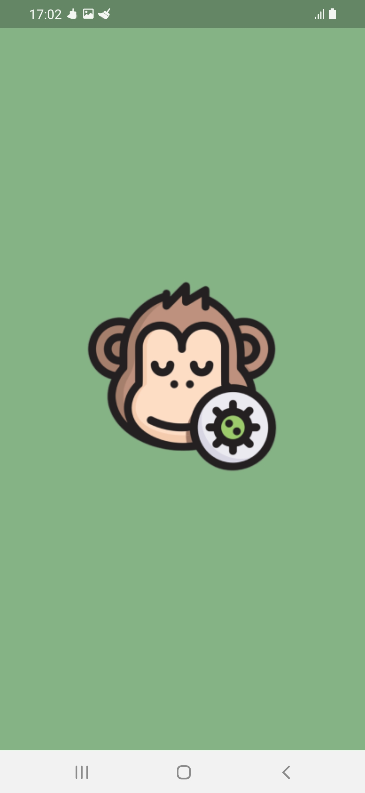
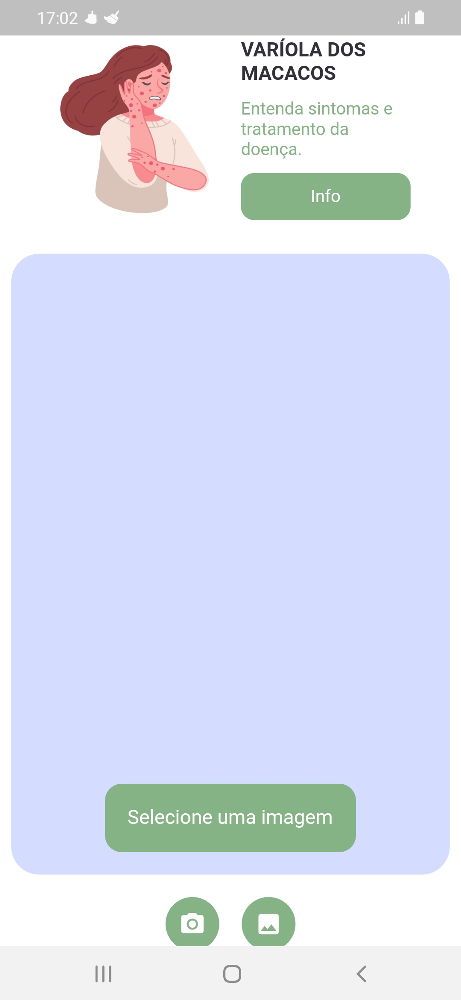

# App Váriola dos macacos

### Criando o ambiente
Abra o terminal
```
mkdir variola_macacos
cd variola_macacos
```
### Criando um projeto
```
flutter create projeto
```

### Abra o VS Code
```
code .
```
### Assets
Crie a pasta de assets na pasta raiz. Em seguida, adicione as imagens, modelo e labels necessárias a esta pasta.

projeto
    assets

Em seguida, abra o arquivo pubspec.yaml, descomente a pasta de assets e adicione o caminho.

```
assets:
    - assets/


# Adicionando packages
```

### tflite

Neste projeto, precisamos do plugin tflite. O plugin do Flutter para acessar a API do Tensorflow Lite. Suporta classificação de imagens, detecção de objetos, Pix2Pix e Deeplab e PoseNet em iOS e Android. Para obter a versão mais recente, visite a página oficial https://pub.dev/packages/tflite.

Abra o arquivo pubspec.yaml e adicione o tflite na seção de dependências.

```
dependencies:
  flutter:
    sdk: flutter


  # The following adds the Cupertino Icons font to your application.
  # Use with the CupertinoIcons class for iOS style icons.
  cupertino_icons: ^1.0.2
  tflite: ^1.1.2

```
### Image Picker

Precisamos também do plugin image_picker. O  plugin do Flutter para selecionar imagens da galeria e tirar fotos com a câmera. Para obter a versão mais recente, visite a página oficial https://pub.dev/packages/image_picker.

Abra o arquivo pubspec.yaml e adicione o image_picker na seção de dependências.

```
dependencies:
  flutter:
    sdk: flutter


  # The following adds the Cupertino Icons font to your application.
  # Use with the CupertinoIcons class for iOS style icons.
  cupertino_icons: ^1.0.2
  tflite: ^1.1.2
  image_picker: ^0.8.4+4

```

### flutter_svg

Foi utilizado a biblioteca de widgets e renderização SVG para Flutter. Para obter a versão mais recente, visite a página oficial https://pub.dev/packages/flutter_svg.

Abra o arquivo pubspec.yaml e adicione o flutter_svg na seção de dependências.

```
dependencies:
  flutter:
    sdk: flutter


  # The following adds the Cupertino Icons font to your application.
  # Use with the CupertinoIcons class for iOS style icons.
  cupertino_icons: ^1.0.2
  tflite: ^1.1.2
  image_picker: ^0.8.4+4
  flutter_svg: ^1.1.6

```

### Implementação
main.dart
```
```

Dentro da pasta lib crie um arquivo dart
home.dart	
```

```

Dentro da pasta lib crie um arquivo dart constant.dart

```
import 'package:flutter/material.dart';

Color kwhite = Color(0xFFFFFFFF);
Color kblack = Color(0xFF000000);
Color kgrey = Color(0xFFC0C0C0);
Color kgreen = Color(0xFF86b386);
Color kyshade = Color(0xFFFCFEFF);
Color kred = Color(0xFF720E07);


```

### Rodando o projeto
```
flutter run
```

  

