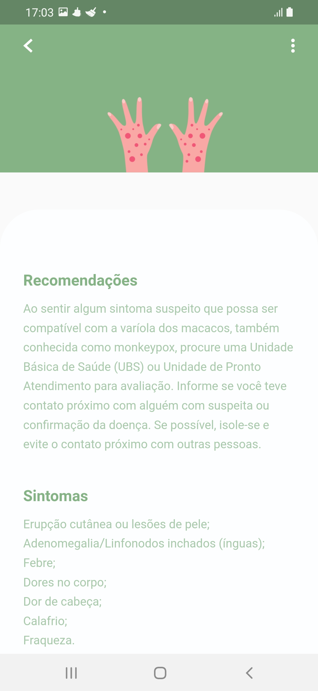

# App Váriola dos macacos

### Criando o ambiente
Abra o terminal
```
mkdir variola_macacos
cd variola_macacos
```
### Criando um projeto
```
flutter create projeto
```

### Abra o VS Code
```
code .
```
### Assets
Crie a pasta de assets na pasta raiz. Em seguida, adicione as imagens, modelo e labels necessárias a esta pasta.

projeto
    assets

Em seguida, abra o arquivo pubspec.yaml, descomente a pasta de assets e adicione o caminho.

```
assets:
    - assets/


# Adicionando packages
```

### tflite

Neste projeto, precisamos do plugin tflite. O plugin do Flutter para acessar a API do Tensorflow Lite. Suporta classificação de imagens, detecção de objetos, Pix2Pix e Deeplab e PoseNet em iOS e Android. Para obter a versão mais recente, visite a página oficial https://pub.dev/packages/tflite.

Abra o arquivo pubspec.yaml e adicione o tflite na seção de dependências.

```
dependencies:
  flutter:
    sdk: flutter


  # The following adds the Cupertino Icons font to your application.
  # Use with the CupertinoIcons class for iOS style icons.
  cupertino_icons: ^1.0.2
  tflite: ^1.1.2

```
### Image Picker

Precisamos também do plugin image_picker. O  plugin do Flutter para selecionar imagens da galeria e tirar fotos com a câmera. Para obter a versão mais recente, visite a página oficial https://pub.dev/packages/image_picker.

Abra o arquivo pubspec.yaml e adicione o image_picker na seção de dependências.

```
dependencies:
  flutter:
    sdk: flutter


  # The following adds the Cupertino Icons font to your application.
  # Use with the CupertinoIcons class for iOS style icons.
  cupertino_icons: ^1.0.2
  tflite: ^1.1.2
  image_picker: ^0.8.4+4

```

### flutter_svg

Foi utilizado a biblioteca de widgets e renderização SVG para Flutter. Para obter a versão mais recente, visite a página oficial https://pub.dev/packages/flutter_svg.

Abra o arquivo pubspec.yaml e adicione o flutter_svg na seção de dependências.

```
dependencies:
  flutter:
    sdk: flutter


  # The following adds the Cupertino Icons font to your application.
  # Use with the CupertinoIcons class for iOS style icons.
  cupertino_icons: ^1.0.2
  tflite: ^1.1.2
  image_picker: ^0.8.4+4
  flutter_svg: ^1.1.6

```

### Implementação

Dentro da pasta lib crie um arquivo dart constant.dart para manter todas as constantes da aplicação para fácil referência.

```
import 'package:flutter/material.dart';

Color kwhite = Color(0xFFFFFFFF);
Color kblack = Color(0xFF000000);
Color kgrey = Color(0xFFC0C0C0);
Color kgreen = Color(0xFF86b386);
Color kyshade = Color(0xFFFCFEFF);
Color kred = Color(0xFF720E07);


```
Dentro da pasta lib crie um arquivo dart splash.dart . Essa sera a tela de abertura, é a primeira tela ao abrir o aplicativo e permanece visível por 3 segundos.
```
import 'dart:async';

import 'package:flutter/material.dart';
import '../../constant.dart';
import '../../home.dart';

void main() {
  runApp(SplashScreen());
}

class SplashScreen extends StatefulWidget {
  @override
  State<StatefulWidget> createState() => StartState();
}

class StartState extends State<SplashScreen> {
  @override
  void initState() {
    // TODO: implement initState
    super.initState();
    startTime();
  }

  // 3s de tempo de tela
  startTime() async {
    var duration = Duration(seconds: 3);
    return new Timer(duration, route);
  }

// rota para tela Home
  route() {
    Navigator.pushReplacement(
        context, MaterialPageRoute(builder: (context) => Home()));
  }

// método para realizar a inicialização
  @override
  Widget build(BuildContext context) {
    return initWidget(context);
  }

// método de construção
//subscribe to the object
  Widget initWidget(BuildContext context) {
    return Scaffold(
      body: Stack(
        children: [
          Container(
            decoration: BoxDecoration(
              color: kgreen,
            ),
          ),
          Center(
            child: Container(
              child: Image.asset("assets/monkeypox.png"),
            ),
          )
        ],
      ),
    );
  }
}

```
main.dart
```
import 'package:flutter/material.dart';
import '../../splash.dart';
void main() {
  runApp(const MyApp());
}

class MyApp extends StatelessWidget {
  const MyApp({Key? key}) : super(key: key);

  // This widget is the root of your application.
  @override
  Widget build(BuildContext context) {
    return MaterialApp(
      debugShowCheckedModeBanner: false,
      title: 'Váriola dos macacos',
      theme: ThemeData(
        // This is the theme of your application.
        //
        // Try running your application with "flutter run". You'll see the
        // application has a blue toolbar. Then, without quitting the app, try
        // changing the primarySwatch below to Colors.green and then invoke
        // "hot reload" (press "r" in the console where you ran "flutter run",
        // or simply save your changes to "hot reload" in a Flutter IDE).
        // Notice that the counter didn't reset back to zero; the application
        // is not restarted.
        primarySwatch: Colors.blue,
      ),
      home:  SplashScreen(),
    );
  }
}

```

Dentro da pasta lib crie um arquivo dart
home.dart	
```
import 'dart:io';

import 'package:flutter/material.dart';
import 'package:flutter/services.dart';
import 'package:image_picker/image_picker.dart';
import 'package:tflite/tflite.dart';
import '../../constant.dart';

import 'detail_screen.dart';

class Home extends StatefulWidget {
  const Home({Key? key}) : super(key: key);

  @override
  _HomeState createState() => _HomeState();
}

class _HomeState extends State<Home> {
  List? _outputs;
  XFile? _image;
  bool _loading = false;

  final ImagePicker _picker = ImagePicker();
  @override
  void initState() {
    super.initState();
    _loading = true;

    loadModel().then((value) {
      setState(() {
        _loading = false;
      });
    });
  }
// carregando o modelo e as labels
  loadModel() async {
    await Tflite.loadModel(
      model: "assets/model_unquant.tflite",
      labels: "assets/labels.txt",
      numThreads: 1,
    );
  }
// classificando as imagens
  classifyImage(File image) async {
    var output = await Tflite.runModelOnImage(
        path: image.path,
        imageMean: 0.0,
        imageStd: 255.0,
        // quantidade de resultados possíveis, classes
        numResults: 4,
        threshold: 0.2,
        asynch: true);
    setState(() {
      _loading = false;
      _outputs = output;
    });
  }

  @override
  void dispose() {
    Tflite.close();
    super.dispose();
  }
// utilizando a câmera
  Future getImageCamera() async {
    var image =
        await _picker.pickImage(source: ImageSource.camera, imageQuality: 50);
    if (image == null) return null;
    setState(() {
      _loading = true;
      _image = image;
    });
    classifyImage(File(_image!.path));
  }
// pegando imagem da galeria
  Future getImageGallery() async {
    var image =
        await _picker.pickImage(source: ImageSource.gallery, imageQuality: 50);
    if (image == null) return null;
    setState(() {
      _loading = true;
      _image = image;
    });
    classifyImage(File(_image!.path));
  }

  @override
  Widget build(BuildContext context) {
    SystemChrome.setEnabledSystemUIMode;
    return Scaffold(
      backgroundColor: Colors.white,
      body: SafeArea(
        child: SingleChildScrollView(
          child: SizedBox(
            height: MediaQuery.of(context).size.height,
            width: MediaQuery.of(context).size.width,
            child: Column(
              children: [
                Padding(
                  padding: const EdgeInsets.symmetric(horizontal: 25.0),
                  child: Container(
                    padding: EdgeInsets.all(20),
                    decoration: BoxDecoration(
                      color: kwhite,
                      borderRadius: BorderRadius.circular(12),
                    ),
                    child: Row(children: [
                      // animação ou imagem
                      Container(
                        height: 150,
                        width: 150,
                        child: Image.asset('assets/card1.png'),
                      ),
                      SizedBox(
                        width: 20,
                      ),
                      // texto + button info
                      Expanded(
                        child: Column(
                          crossAxisAlignment: CrossAxisAlignment.start,
                          children: [
                            Text(
                              'VARÍOLA DOS MACACOS',
                              style: TextStyle(
                                fontWeight: FontWeight.bold,
                                fontSize: 16,
                                color: Color(0xFF32313A),
                              ),
                            ),
                            SizedBox(height: 12),
                            Text(
                              'Entenda sintomas e tratamento da doença.',
                              style: TextStyle(
                                fontSize: 14,
                                color: Color(0xFF86b386),
                              ),
                            ),
                            SizedBox(height: 12),
                            Container(
                              padding: EdgeInsets.all(12),
                              decoration: BoxDecoration(
                                color: Color(0xFF86b386),
                                borderRadius: BorderRadius.circular(12),
                              ),
                              child: Center(
                                child: GestureDetector(
                                  //botao
                                  child: Text(
                                    'Info',
                                    style: TextStyle(color: kyshade),
                                  ),
                                  onTap: () {
                                    // Write Tap Code Here.
                                    Navigator.push(
                                        context,
                                        MaterialPageRoute(
                                          builder: (context) => DetailScreen(),
                                        ));
                                  },
                                ),
                              ),
                            ),
                          ],
                        ),
                      ),
                    ]),
                  ),
                ),
                // box da imagem
                Expanded(
                  flex: 9,
                  child: _image == null
                      ? Container(
                          margin: const EdgeInsets.all(10),
                          decoration: const BoxDecoration(
                            color: Color(0xFFD4DCFF),
                            borderRadius:
                                BorderRadius.all(Radius.circular(25.0)),
                          ),
                          child: Align(
                            alignment: Alignment.bottomCenter,
                            child: Container(
                              margin: const EdgeInsets.all(20),
                              decoration: BoxDecoration(
                                  color: Color(0xFF86b386),
                                  borderRadius: BorderRadius.circular(15)),
                              padding: const EdgeInsets.all(20),
                              child: const Text(
                                "Selecione uma imagem",
                                style: TextStyle(
                                    fontSize: 16, color: Colors.white),
                              ),
                            ),
                          ),
                        )
                      : Container(
                          margin: const EdgeInsets.all(10),
                          decoration: BoxDecoration(
                            image: DecorationImage(
                                image: FileImage(File(_image!.path)),
                                fit: BoxFit.cover),
                            color: Colors.transparent,
                            borderRadius:
                                const BorderRadius.all(Radius.circular(25.0)),
                          ),
                          child: Align(
                            alignment: Alignment.bottomCenter,
                            child: Container(
                              margin: const EdgeInsets.all(20),
                              decoration: BoxDecoration(
                                  color: Colors.black26,
                                  borderRadius: BorderRadius.circular(15)),
                              padding: const EdgeInsets.all(20),
                              child: Text(
                                _outputs?[0]["label"] ?? "",
                                style: const TextStyle(
                                    fontSize: 20,
                                    fontWeight: FontWeight.w600,
                                    color: Colors.white),
                              ),
                            ),
                          ),
                        ),
                ),
                Container(
                    width: double.infinity,
                    decoration: const BoxDecoration(
                      borderRadius: BorderRadius.only(
                        topRight: Radius.circular(15.0),
                        topLeft: Radius.circular(15.0),
                      ),
                    ),
                    child: Row(
                      mainAxisAlignment: MainAxisAlignment.center,
                      children: [
                        // câmera
                        Container(
                          margin: const EdgeInsets.all(10),
                          decoration: const BoxDecoration(
                            color: Color(0xFF86b386),
                            shape: BoxShape.circle,
                          ),
                          child: IconButton(
                              onPressed: () {
                                getImageCamera();
                              },
                              icon: const Icon(
                                Icons.camera_alt,
                                color: Colors.white,
                              )),
                        ),
                        // galeria
                        Container(
                          margin: const EdgeInsets.all(10),
                          decoration: const BoxDecoration(
                            color: Color(0xFF86b386),
                            shape: BoxShape.circle,
                          ),
                          child: IconButton(
                              onPressed: () {
                                getImageGallery();
                              },
                              icon: const Icon(
                                Icons.image,
                                color: Colors.white,
                              )),
                        )
                      ],
                    )),
              ],
            ),
          ),
        ),
      ),
    );
  }
}

```

### Rodando o projeto
```
flutter run
```

  

